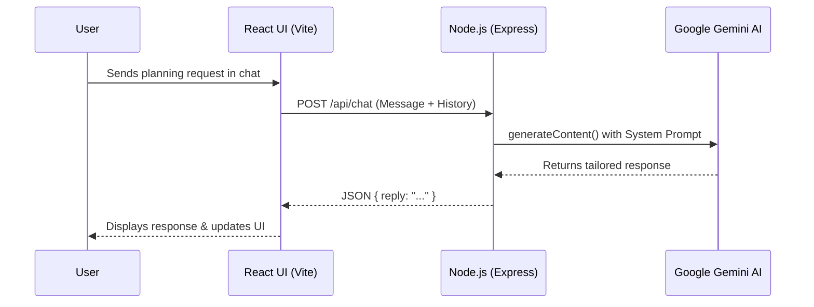

# PartyMind: Unified Personal Event Planner Agent

## 1. Introduction & Problem Statement
Planning an event, especially a large-scale Indian celebration like a milestone birthday or wedding, is traditionally a highly stressful, fragmented, and time-consuming process. Hosts must juggle multiple vendors, manage a strict budget, keep track of endless checklists, and accommodate cultural nuances without a centralized system. Existing tools are often generic task-managers that lack the domain-specific intelligence needed to actively assist with event planning.

## 2. Proposed Solution
**PartyMind** is a full-stack, AI-powered unified personal event planner. It acts not just as a dashboard, but as an intelligent, conversational agent that actively helps hosts plan their events. By leveraging generative AI, PartyMind provides dynamic, culturally-aware suggestions, instant itinerary planning, and budget estimations, all wrapped in a premium, highly interactive user interface. 

For its pilot implementation, PartyMind is customized to assist in planning a grand Indian birthday event ("Samanvi's Birthday Bash" in Belagavi, Karnataka), demonstrating its ability to handle localized logistics, currency (INR), and cultural context.

## 3. System Architecture & Flow Diagram

The application uses a modern client-server architecture, deployed securely to Google Cloud Run. The React frontend interacts with the Node.js backend, which acts as a secure proxy to the Google Gemini AI model.

## 4. Key Features
- **Conversational AI Planner:** A built-in chat interface powered by Google's Gemini AI that provides tailored suggestions for venues, themes, return gifts, and catering.
- **Interactive Dashboard:** A centralized hub to monitor the countdown to the event, venue details, and high-level metrics.
- **Dynamic Task Management:** A stateful checklist tracking upcoming tasks and calculating real-time completion progress.
- **Budget Tracking:** A financial overview widget to keep event expenses within the designated budget limit.
- **Guest List Management:** Real-time metrics on RSVP status and total invited guests.

## 5. Tech Stack
PartyMind follows a modern, containerized client-server architecture designed for scalability and rapid iteration:

- **Frontend (Client):** 
  - **Framework:** React.js built with Vite for optimal performance.
  - **Styling:** Custom CSS leveraging modern "Glassmorphism" design principles and Indian-inspired color palettes.
- **Backend (Server):** 
  - **Environment:** Node.js with the Express.js framework.
  - **AI Integration:** The official `@google/genai` SDK is used to securely communicate with the Gemini 2.5 Flash model. 
- **Infrastructure & Deployment:**
  - **Containerization:** A multi-stage `Dockerfile` packages the app.
  - **Hosting:** Deployed to **Google Cloud Run** for serverless, autoscaling execution.

## 6. Future Scope
1. **Database Integration:** Utilizing Firebase or PostgreSQL to persist user accounts, multiple events, and chat histories.
2. **Vendor Marketplace:** Direct API integrations to book local decorators, caterers, and venues directly from the chat interface.
3. **Automated Itinerary Generation:** Allowing the AI to generate downloadable PDF schedules for the day of the event.
