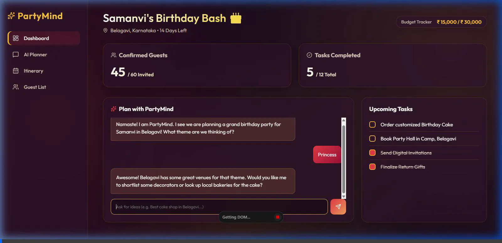
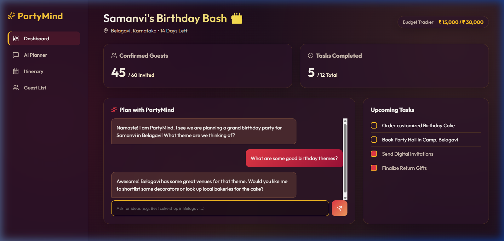
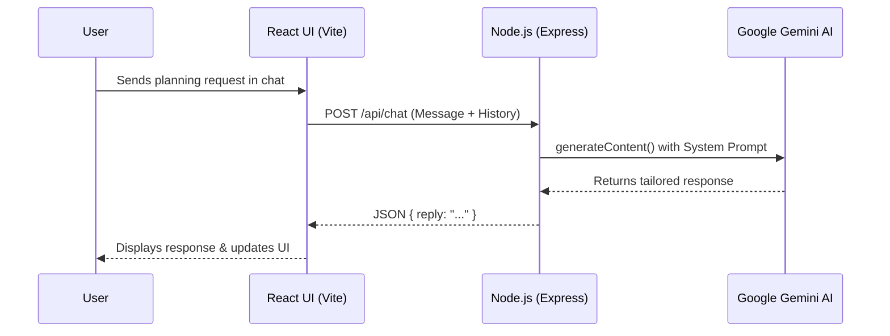

# PartyMind ✨ 

**Unified Personal Event Planner Agent**

PartyMind is an AI-powered personal event planner designed to handle the end-to-end process of organizing personal events (birthdays, anniversaries, small get-togethers, etc.). It acts as your AI Event Architect, actively helping you make decisions, generating ideas, and building an actionable plan.

This repository features the localized "Indian Birthday Planner" MVP, currently customized for **Samanvi's Birthday Bash in Belagavi, Karnataka**.

## The Problem
Planning a large-scale event, especially with cultural nuances, is highly stressful, fragmented, and time-consuming. Users must juggle multiple vendors, manage a strict budget, and keep track of endless checklists without a centralized system. Generic task-managers lack the domain-specific intelligence needed to actively assist with event planning, leaving the cognitive load entirely on the host.

## The Solution
**PartyMind** solves this by acting as a proactive, conversational AI Event Architect. By leveraging generative AI (Google Gemini), it provides dynamic, culturally-aware suggestions, instant itinerary planning, and budget estimations. It transforms the user experience from passive data entry into an interactive, guided planning journey wrapped in a premium, highly interactive UI.

## Features 🚀

- **AI Event Architect (The Agent)**: A conversational interface to brainstorm ideas, get suggestions, and build a cohesive event plan.
- **Event Dashboard**: A centralized, visually stunning overview of the event featuring a countdown, budget tracker, and task status.
- **Intelligent Task & Budget Tracker**: Auto-populated to-do lists and expense tracking.
- **Guest List & RSVPs**: Simple CRM to track attendees.
- **Premium UI/UX**: Designed using modern glassmorphism aesthetics, vibrant Indian-inspired gradients, and responsive micro-animations.

## Demonstration & Workflows 🎥

Here is how the AI Agent chat interface works for planning:



*The AI provides location-specific and theme-specific recommendations based on your prompts.*

### Dashboard Overview


### System Architecture Flow


## Tech Stack 💻
- **Frontend Framework**: React.js with Vite
- **Styling**: Vanilla CSS (CSS Variables, Flexbox/Grid, Backdrop-filters)
- **Icons**: Lucide React
- **Backend Framework**: Node.js with Express
- **AI Integration**: Google Gemini 2.5 Flash via `@google/genai` SDK
- **Deployment**: Google Cloud Run (Containerized via Docker)

## Getting Started 🛠️

To run PartyMind locally:

1. Clone this repository
2. Navigate to the project directory: `cd partymind`
3. Install dependencies: `npm install`
4. Create a `.env` file in the root directory and add your Google Gemini API Key:
   ```env
   GEMINI_API_KEY=your_api_key_here
   ```
5. Start the backend server AND frontend concurrently:
   - Run the frontend: `npm run dev`
   - In a separate terminal, run the backend: `npm run dev:server`
6. Open `http://localhost:5173` in your browser.
